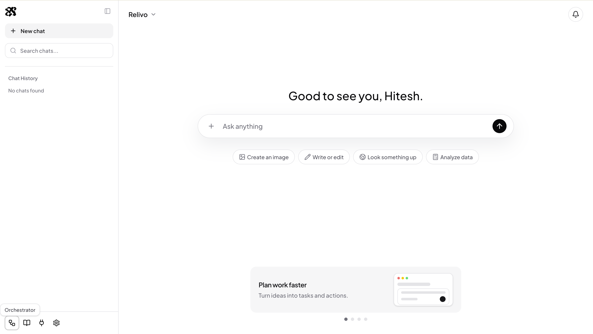

# Relivo

Relivo is an agent orchestration platform for building, running, and embedding AI agent workflows.

Build an agent workflow once, then use it through Relivo Chat, a streaming API, SDKs, embeddable UI components, or existing business applications.



## Product Direction

Relivo helps teams avoid rebuilding the same agent infrastructure from scratch: orchestration, streaming, tool execution, MCP connectivity, state, usage tracking, logs, and chat UI.

Core product areas:

- Workspaces for teams, members, environments, credentials, logs, and usage.
- Agents with model configuration, instructions, skills, tools, memory, and guardrails.
- Workflows that coordinate agents, skills, tools, conditions, retries, and final responses.
- MCP server connections for external tools, APIs, and business systems.
- Deployments that expose published workflow versions through chat, API, SDKs, and embedded UI.
- Run observability for workflow path, model calls, tool calls, latency, token usage, errors, and streamed events.

## Repository

This repository contains the Relivo frontend server built with Next.js, TypeScript, React, Tailwind CSS, Clerk, and TanStack Query.

The current frontend includes:

- Public website pages for product, pricing, contact, blog, and docs.
- Authenticated app shell with chat, conversation history, settings dialog, and connectors.
- Streaming chat integration through a same-origin proxy to the Relivo backend.
- Documentation for current chat streaming behavior and product requirements.

## Documentation

- [Documentation index](./docs/README.md)
- [Product requirements](./docs/product-requirements.md)
- [Current chat streaming API](./docs/api-chat.md)

## Getting Started

Install dependencies:

```bash
npm install
```

Run the frontend:

```bash
npm run dev
```

The configured development server runs on:

```txt
http://localhost:3001
```

Configure the Relivo backend URL:

```env
RELIVO_API_URL=http://localhost:8000
NEXT_PUBLIC_RELIVO_API_URL=http://localhost:8000
```

## Scripts

```bash
npm run dev          # Start Next.js on port 3001
npm run build        # Build for production
npm run lint         # Run ESLint
npm run typecheck    # Run TypeScript checks
npm run format       # Format the repository
```

## MVP Focus

The MVP focuses on one complete flow:

```txt
Create workflow -> Test workflow -> Publish workflow -> Chat/API usage
```

Near-term product priorities:

1. Workspace and authentication.
2. Agent creation and model configuration.
3. Custom skills and URL-based MCP server integration.
4. Workflow orchestration with visible run events.
5. Real-time streaming through chat and API.
6. Deployment, API keys, usage tracking, and basic logs.
7. Documentation and developer onboarding.
